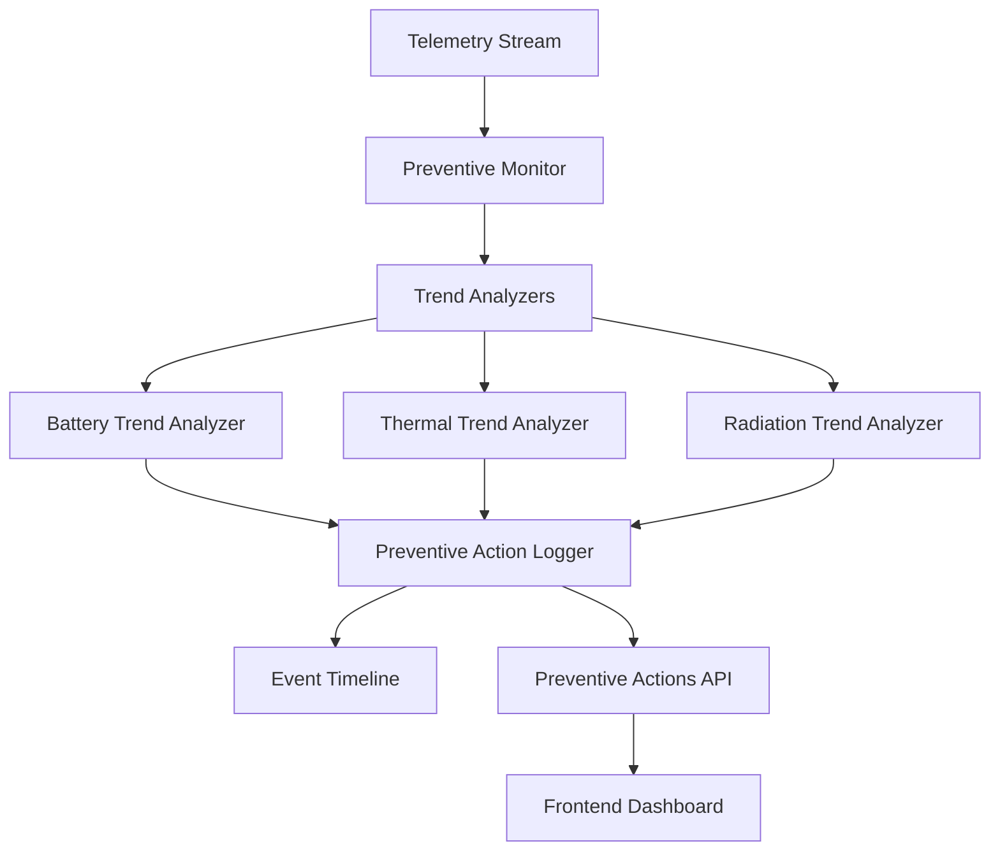
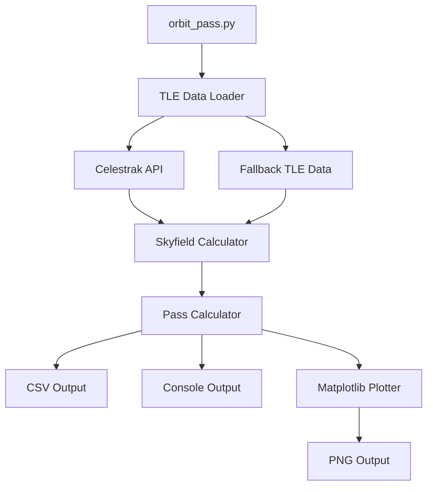

# Design Document

## Overview

This design implements two complementary features for the SURAKSHASat system:

1. **Preventive Action System**: A trend-monitoring system that detects concerning telemetry patterns before they become critical anomalies, providing early warnings while maintaining normal operations.

2. **Orbit Pass Simulation**: A standalone orbital mechanics calculator that determines CubeSat visibility windows over Bangalore using real TLE data and the Skyfield library.

The preventive action system integrates with the existing telemetry and recovery architecture, while the orbit simulation operates as an independent module that can be used for mission planning.

## Architecture

### Preventive Action System Architecture



### Orbit Simulation Architecture



## Components and Interfaces

### 1. Preventive Action Monitor (`preventive.py`)

**Purpose**: Core component that monitors telemetry trends and triggers preventive actions.

**Key Classes**:

- `PreventiveActionMonitor`: Main monitoring class
- `TrendAnalyzer`: Base class for trend analysis
- `BatteryTrendAnalyzer`: Monitors battery voltage trends
- `ThermalTrendAnalyzer`: Monitors temperature increase rates
- `RadiationTrendAnalyzer`: Monitors radiation spikes

**Interface**:

```python
class PreventiveActionMonitor:
    def __init__(self, simulator: TelemetrySimulator)
    def process_telemetry(self, telemetry: TelemetryData) -> List[PreventiveAction]
    def get_recent_actions(self, limit: int = 50) -> List[Dict]
    def add_analyzer(self, analyzer: TrendAnalyzer)
```

**Integration Points**:

- Integrates with `TelemetrySimulator` via callback mechanism
- Logs actions to the same event timeline as anomalies/recoveries
- Provides data to new API endpoint

### 2. Trend Analyzers

**Battery Trend Analyzer**:

- Maintains sliding window of last 5 battery voltage samples
- Detects steady decrease (all samples decreasing)
- Triggers when voltage > 6.6V but trending down

**Thermal Trend Analyzer**:

- Calculates temperature change rate per minute
- Monitors payload_temp_c specifically
- Triggers when rate > 2°C/min and temp < 45°C

**Radiation Trend Analyzer**:

- Detects radiation spikes above 10 cps
- Triggers when rad_cps > 10 but < 50 cps
- Provides early warning before critical threshold

### 3. API Extensions (`main.py`)

**New Endpoint**:

```python
@app.get("/preventive/actions")
async def get_preventive_actions() -> List[PreventiveActionResponse]
```

**Response Model**:

```python
class PreventiveActionResponse(BaseModel):
    timestamp: datetime
    type: str
    description: str
    telemetry_snapshot: Dict[str, Any]
    severity: str = "warning"
```

### 4. Orbit Pass Calculator (`orbit_pass.py`)

**Purpose**: Standalone script for calculating CubeSat visibility passes over Bangalore.

**Key Components**:

- `TLELoader`: Handles TLE data retrieval with fallback
- `PassCalculator`: Computes visibility passes using Skyfield
- `OutputGenerator`: Creates CSV, console, and plot outputs

**Dependencies**:

- `skyfield`: Orbital mechanics calculations
- `matplotlib`: Plotting elevation curves
- `requests`: TLE data retrieval
- `pandas`: CSV output formatting

**Interface**:

```python
class PassCalculator:
    def __init__(self, tle_lines: List[str], ground_station: GroundStation)
    def calculate_next_passes(self, count: int = 3) -> List[Pass]
    def generate_elevation_plot(self, passes: List[Pass]) -> None
    def save_to_csv(self, passes: List[Pass], filename: str) -> None
```

## Data Models

### Preventive Action Data Model

```python
@dataclass
class PreventiveAction:
    timestamp: datetime
    action_type: str  # "BATTERY_TREND", "THERMAL_TREND", "RADIATION_TREND"
    description: str
    telemetry_snapshot: Dict[str, Any]
    severity: str = "warning"
    triggered_by: str  # Parameter that triggered the action
```

### Orbit Pass Data Model

```python
@dataclass
class Pass:
    start_time: datetime
    end_time: datetime
    duration_seconds: float
    max_elevation_deg: float
    max_elevation_time: datetime

@dataclass
class GroundStation:
    latitude_deg: float = 12.9716  # Bangalore
    longitude_deg: float = 77.5946
    elevation_m: float = 0.0
```

## Error Handling

### Preventive Action System

1. **Telemetry Processing Errors**:

   - Wrap trend analysis in try-catch blocks
   - Log errors without disrupting main telemetry stream
   - Continue processing with remaining analyzers if one fails

2. **Data Validation**:
   - Validate telemetry data before trend analysis
   - Handle missing or invalid telemetry gracefully
   - Skip analysis cycles with insufficient data

### Orbit Simulation

1. **Network Connectivity**:

   - Attempt Celestrak TLE download with timeout
   - Fall back to hardcoded ISS TLE on network failure
   - Provide clear error messages for connectivity issues

2. **TLE Data Validation**:

   - Validate TLE format before processing
   - Check TLE age and warn if data is stale
   - Handle malformed TLE data gracefully

3. **Calculation Errors**:
   - Validate ground station coordinates
   - Handle edge cases in pass calculations
   - Provide meaningful error messages for calculation failures

## Testing Strategy

### Unit Tests

1. **Trend Analyzers**:

   - Test battery voltage trend detection with synthetic data
   - Test thermal rate calculations with various temperature profiles
   - Test radiation spike detection with different scenarios

2. **Orbit Calculations**:
   - Test pass calculations with known TLE data
   - Verify ground station coordinate handling
   - Test fallback TLE functionality

### Integration Tests

1. **Preventive Action Integration**:

   - Test integration with telemetry simulator
   - Verify API endpoint responses
   - Test event logging integration

2. **End-to-End Orbit Simulation**:
   - Test complete orbit_pass.py execution
   - Verify all output files are generated
   - Test with both online and offline scenarios

### Performance Considerations

1. **Preventive Monitoring**:

   - Minimize impact on telemetry stream performance
   - Use efficient sliding window implementations
   - Limit memory usage for trend data storage

2. **Orbit Calculations**:
   - Cache TLE data to avoid repeated downloads
   - Optimize pass calculations for reasonable execution time
   - Handle large datasets efficiently

## Security Considerations

1. **External Data Sources**:

   - Validate TLE data from Celestrak before processing
   - Use HTTPS for TLE downloads
   - Implement request timeouts to prevent hanging

2. **File Operations**:
   - Validate output file paths
   - Handle file permission errors gracefully
   - Prevent path traversal vulnerabilities

## Future Extensibility

### AI Integration Preparation

The preventive action system is designed with modularity to support future AI integration:

1. **Pluggable Analyzers**: New AI-based analyzers can be added without modifying core logic
2. **Standardized Interface**: All analyzers follow the same interface for easy replacement
3. **Data Pipeline**: Telemetry data pipeline supports additional processing stages
4. **Action Framework**: Preventive actions use a flexible framework that can accommodate AI-generated suggestions

### Orbit Simulation Extensions

1. **Multiple Ground Stations**: Architecture supports adding additional ground station locations
2. **Advanced Orbital Models**: Can be extended to support more sophisticated orbital mechanics
3. **Real-time Tracking**: Foundation for real-time satellite tracking capabilities
4. **Mission Planning**: Can be extended to support comprehensive mission planning tools
